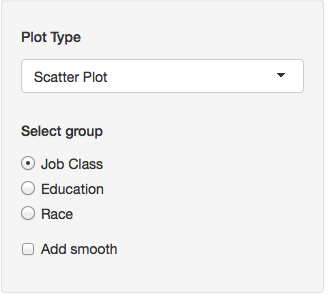

## Wage data exploration

>  The appplication is hosted on shinyapss.io and can be accessed here: [Shiny application](https://denitram.shinyapps.io/shiny_test).  

>  The shiny application's code is published to Github and can be accessed here: [Code](https://github.com/denitram/wage_shiny_app.git)


>  It demonstrates some aspects of a `Shiny's application` and produces plots of the `Wage` dataset witch is available in the `ISLR` package.  

>  The goal of producing this exploratory plots is to better understand the relationship between the different variables and detect variables that might be important in a model.

### Content

`Slide 3`: Side panel explained  
`Slide 4`: Preparation of the dataset  
`Slide 5`: Plotting example  

--- .class #id &twocol w1:50% w2:50%

## Shiny application

*** =left
### Sidebar panel

*** =right

### Functionality
In thet sidebar panel we use `Shiny widgets` to interract with the plot. 

>  `Select box`  
   Choices between Scatter Plot, Box Plot, Violin, Step and Density Plot  
>  `Radio buttons`  
   Colors the data according to the selected group  
>  `Checkbox`  
   Conditional panel only shows when Scatter plot is selected 

--- 

## Loading and Preparing the data

```{r,message=FALSE}
library(shiny)
library(ISLR); library(ggplot2); library(caret);
data(Wage)
```

`Get training/test sets`  
```{r}
inTrain <- createDataPartition(y=Wage$wage, p=0.7, list=FALSE)
training <- Wage[inTrain,]; testing <- Wage[-inTrain,]
dim(training); dim(testing)
```

--- &twocol w1:60% w2:40%

## Plotting the Wage data

```{r, eval=FALSE}
qplot(x = age, y = wage, colour = jobclass, data = training) + geom = c(points) 
```

*** =left
```{r, echo=FALSE}
qplot(x = age, y = wage, colour = jobclass, data = training) 
+ geom = c(points) 
```

*** =right
We want to explore the relation between `wage` and `age` in respect with others variables, in this example `Job Class`.  

The plot shows that most of the individuals that are up
in the above chunk comes from the information
based jobs as opposed to the industrial jobs.


